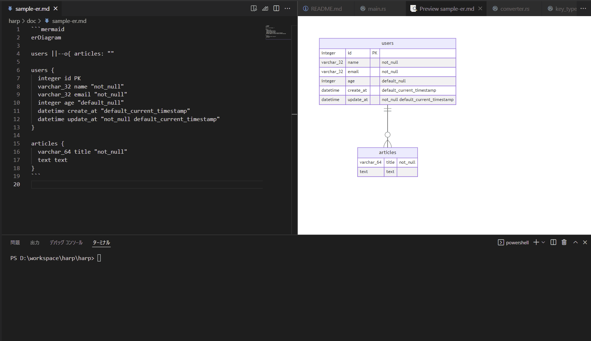

# harp

`harp` converts ER-diagram by mermaid to DDL query.

# Usage

```sh
$ cargo run help

USAGE:
    harp.exe [OPTIONS] <SUBCOMMAND>

FLAGS:
    -h, --help       Prints help information
    -V, --version    Prints version information

OPTIONS:
SUBCOMMANDS:
    convert    Write a memver to the journal file
    help       Prints this message or the help of the given subcommand(s)
```

- `$ cargo convert ./doc/sample-er.md`



# TIPS

## Remarks

- "default"
  - "default_null"
  - "default_current_timestamp"
- "not_null"
