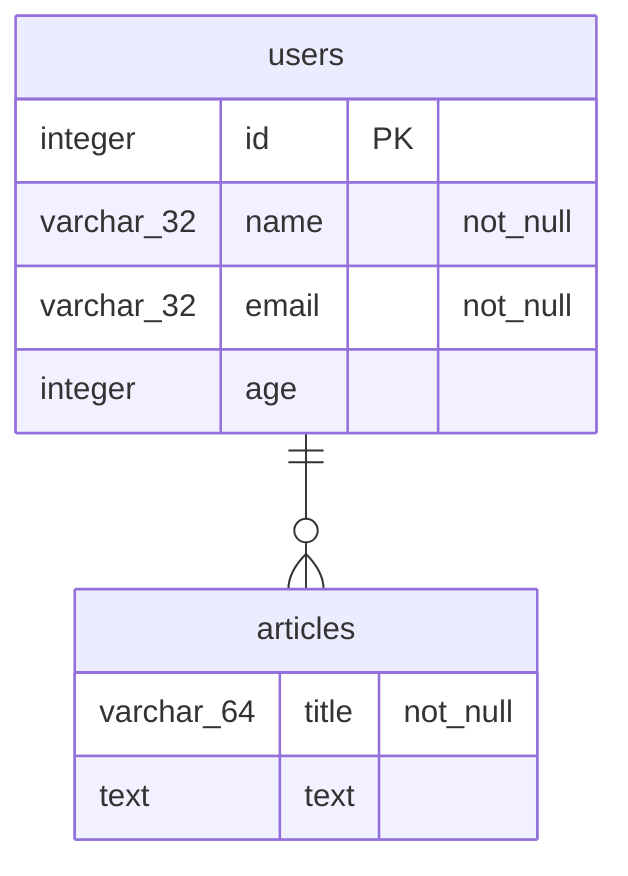

```mermaid
erDiagram

users ||--o{ articles: ""

users {
  integer id PK
  varchar_32 name "not_null"
  varchar_32 email "not_null"
  integer age
}

articles {
  varchar_64 title "not_null"
  text text
}
```
